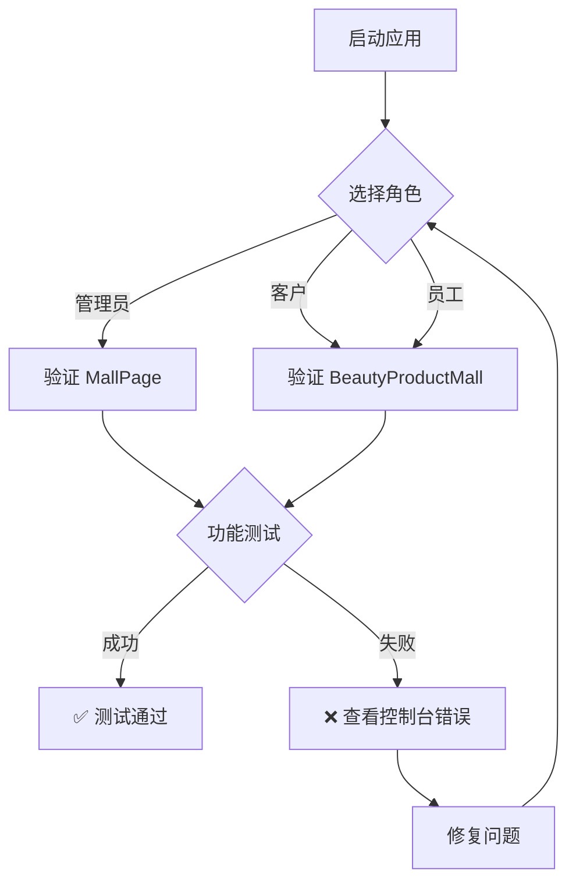

# 快速测试双路由商城系统

## 测试概述

本文档提供了快速验证双路由商城系统的步骤，确保管理员和客户能够正确访问各自的商城。

## 快速开始

### 前置条件
```bash
npm run dev
```
系统应该正常启动，无报错。

## 测试场景

### 场景 1: 管理员访问商城

**预期结果**: 看到 MallPage（店铺装修编辑界面）

#### 操作步骤
```
1. 打开应用首页
2. 在登录/角色选择页面，选择 "管理员" 角色
3. 登录后，点击底部导航栏的 "商城" 按钮
4. 观察显示的内容
```

#### 验证清单
- ✅ 页面显示为 MallPage（装修编辑界面）
- ✅ 包含模板库选择
- ✅ 包含组件编辑功能
- ✅ 包含实时预览区域
- ✅ 显示装修相关的按钮和菜单

#### 不应该看到的内容
- ❌ 产品列表
- ❌ 购物车功能
- ❌ 产品搜索栏

---

### 场景 2: 客户访问商城

**预期结果**: 看到 BeautyProductMall（美容产品购物界面）

#### 操作步骤
```
1. 打开应用首页
2. 在登录/角色选择页面，选择 "客户" 角色
3. 登录后，点击底部导航栏的 "商城" 按钮
4. 观察显示的内容
```

#### 验证清单
- ✅ 页面显示为 BeautyProductMall（购物界面）
- ✅ 显示美容产品列表（8 个产品）
- ✅ 包含产品搜索功能
- ✅ 包含分类筛选侧边栏
- ✅ 显示购物车图标和产品卡片

#### 不应该看到的内容
- ❌ 装修编辑工具
- ❌ 模板库
- ❌ 组件编辑面板

---

### 场景 3: 员工访问商城

**预期结果**: 看到 BeautyProductMall（与客户相同）

#### 操作步骤
```
1. 打开应用首页
2. 在登录/角色选择页面，选择 "员工" 角色
3. 登录后，点击底部导航栏的 "商城" 按钮
4. 观察显示的内容
```

#### 验证清单
- ✅ 页面显示为 BeautyProductMall（购物界面）
- ✅ 功能与客户角色相同
- ✅ 可以搜索、筛选、添加购物车

---

### 场景 4: 购物车功能（客户）

**预期结果**: 能够成功添加产品到购物车

#### 操作步骤
```
1. 以客户身份进入商城
2. 点击任一产品的 "加入购物车" 按钮
3. 观察购物车图标的变化
4. 点击购物车图标查看已添加的产品
```

#### 验证清单
- ✅ 点击后显示成功提示
- ✅ 购物车图标显示产品数量
- ✅ 购物车弹窗显示已添加的产品
- ✅ 可以增加/减少产品数量
- ✅ 显示总价

---

### 场景 5: 装修编辑（管理员）

**预期结果**: 能够进行装修编辑操作

#### 操作步骤
```
1. 以管理员身份进入商城
2. 选择一个装修模板
3. 尝试编辑模板中的组件
4. 点击预览按钮
```

#### 验证清单
- ✅ 模板列表正常显示
- ✅ 可以选择模板
- ✅ 编辑面板响应正常
- ✅ 预览功能可用

---

## 浏览器开发者工具检查

### 控制台 (Console)

应该看到的日志：
```
✅ 无红色 ERROR 日志
✅ React 组件加载日志正常
✅ 无 404 资源加载错误
```

不应该看到的：
```
❌ "BeautyProductMall is not defined"
❌ "MallPage is not defined"
❌ 路由切换错误
❌ 类型检查错误
```

### 网络 (Network)

所有资源加载状态应该是：
```
✅ JS 文件: 200 OK
✅ CSS 文件: 200 OK
✅ 图片: 200 OK 或 缓存
```

### 应用程序 (Application)

验证 localStorage 存储正确的角色信息：
```
✅ userRole: admin / customer / staff / manager
✅ 页面刷新后角色保留
```

---

## 性能检查

### 加载时间

| 指标 | 预期 | 说明 |
|------|------|------|
| 首次加载 | < 3s | 包括编译和资源加载 |
| 角色切换 | < 1s | 路由切换速度 |
| 商城页面 | 瞬间 | 已编译的页面 |

### 构建检查

```bash
npm run build
```

应该输出：
```
✅ TypeScript 检查通过
✅ dist 文件夹成功生成
✅ 无编译错误
```

---

## 快速故障排除

### 问题 1: 无论选择什么角色，都看到客户商城

**可能原因**:
- `userRole` 状态未正确传递
- 路由条件中 `userRole` 为 null

**解决方案**:
```bash
# 1. 检查浏览器控制台是否有错误
# 2. 清除浏览器缓存
# 3. 重新启动开发服务器
npm run dev
```

### 问题 2: 管理员看不到装修界面

**可能原因**:
- MallPage 组件未导入
- 路由逻辑错误

**检查方式**:
```typescript
// 在 src/App.tsx 中验证
import { MallPage } from './components/MallPage';  // 应该存在

// 验证路由逻辑
case 'shop':
  return userRole === 'admin' ? <MallPage /> : <BeautyProductMall />;
```

### 问题 3: BeautyProductMall 显示空白或错误

**可能原因**:
- BeautyProductMall 组件有语法错误
- 依赖的服务未正确导入

**解决方案**:
```bash
# 1. 检查编译日志
npm run dev

# 2. 查看浏览器控制台错误
# 3. 检查组件文件：
cat src/components/BeautyProductMall.tsx
```

---

## 代码验证

### 验证导入语句
```bash
# 查看是否有正确的导入
grep -n "MallPage\|BeautyProductMall" src/App.tsx

# 预期输出：
# 11:import { BeautyProductMall } from './components/BeautyProductMall';
# 12:import { MallPage } from './components/MallPage';
```

### 验证路由逻辑
```bash
# 查看 shop case 实现
grep -A 2 "case 'shop'" src/App.tsx

# 预期输出：
# case 'shop':
#   // 管理员使用原 MallPage，客户使用新的美容产品商城
#   return userRole === 'admin' ? <MallPage /> : <BeautyProductMall />;
```

---

## 完整的端到端测试流程



---

## 提交前检查清单

- [ ] ✅ npm run dev 正常启动
- [ ] ✅ 管理员能看到 MallPage
- [ ] ✅ 客户能看到 BeautyProductMall
- [ ] ✅ 员工看到客户商城
- [ ] ✅ 购物车功能正常（客户）
- [ ] ✅ 装修功能正常（管理员）
- [ ] ✅ 浏览器控制台无错误
- [ ] ✅ 构建成功：npm run build
- [ ] ✅ 代码无格式错误
- [ ] ✅ Git 状态干净

---

## 相关文档

- **系统架构**: `DUAL_ROUTE_MALL_SYSTEM.md`
- **美容商城指南**: `BEAUTY_PRODUCT_MALL_GUIDE.md`
- **应用主文件**: `src/App.tsx`
- **管理员商城**: `src/components/MallPage.tsx`
- **客户商城**: `src/components/BeautyProductMall.tsx`

---

## 版本信息

- **日期**: 2024 年 10 月 29 日
- **功能**: 双路由商城系统
- **状态**: 生产就绪

---

**祝您测试愉快！** 🎉
